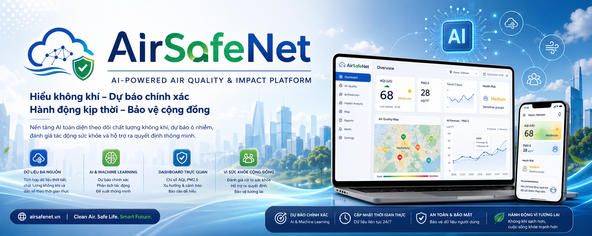
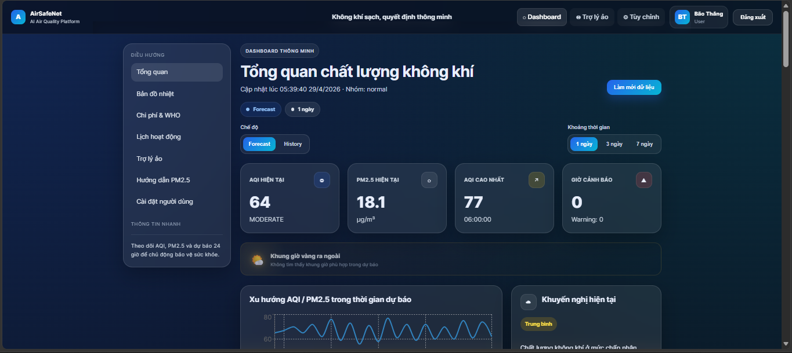
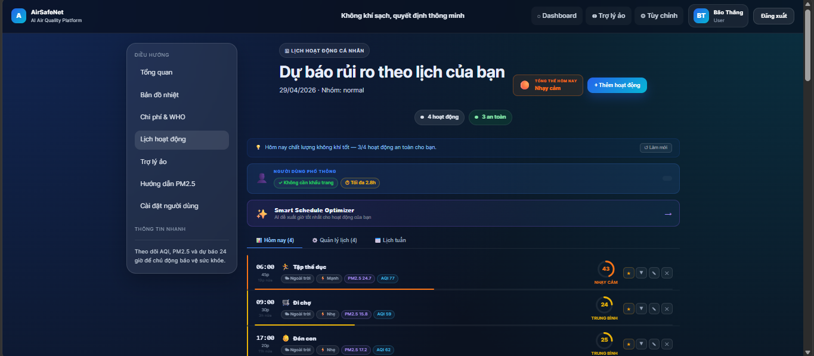
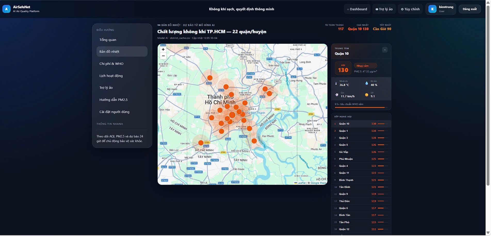
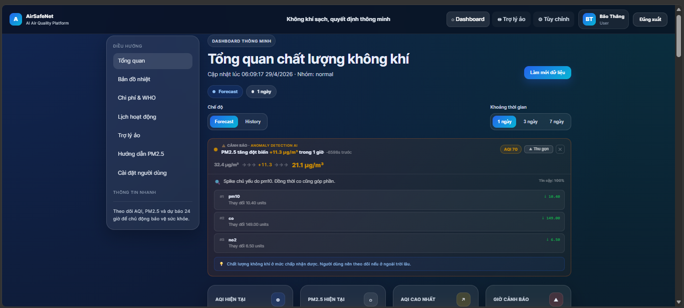
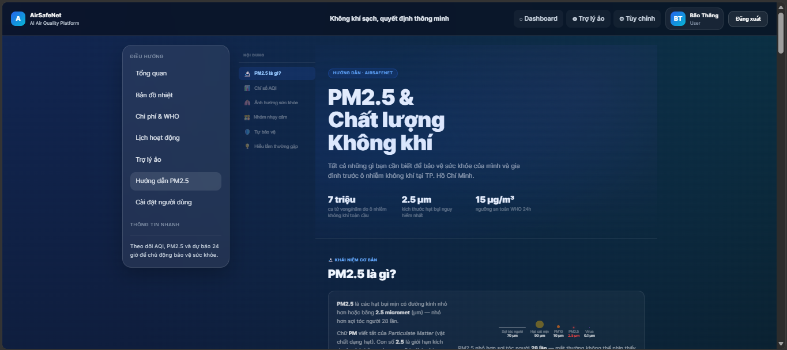
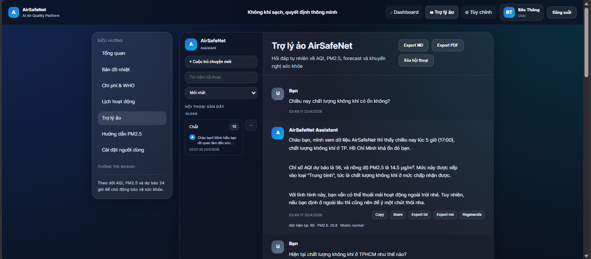
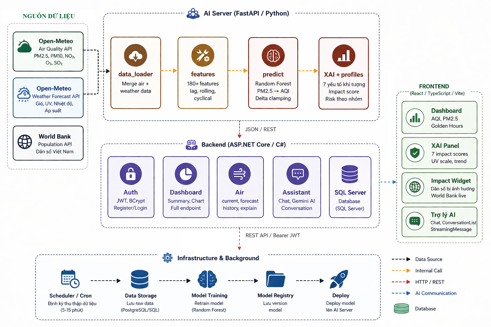
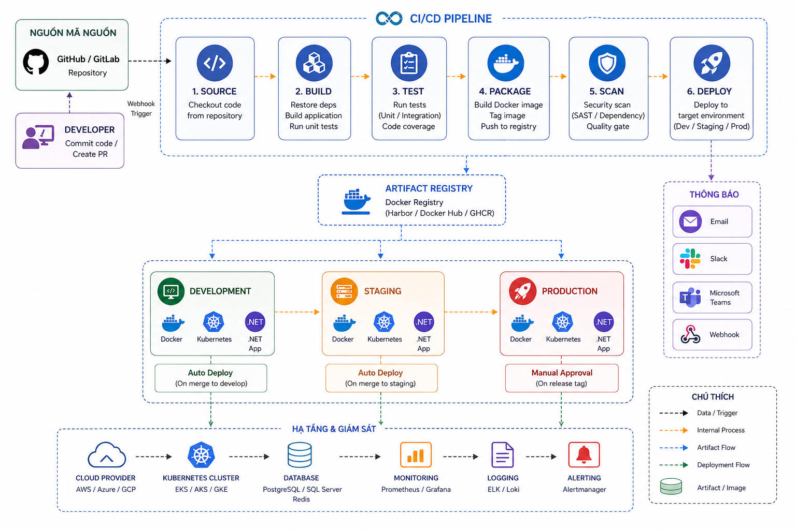

<p align="center">
  
</p>

<h1 align="center">AirSafeNet</h1>

<p align="center">
  <b>AI-powered Air Quality Monitoring, Forecasting & Personalized Early Warning System for Ho Chi Minh City</b>
</p>

<p align="center">
  <a href="https://github.com/NguyenTriBaoThang/AirSafeNet/actions/workflows/ci.yml">
    
  </a>
  <a href="https://github.com/NguyenTriBaoThang/AirSafeNet/stargazers">
    
  </a>
  <a href="./LICENSE">
    
  </a>
  <a href="./SECURITY.md">
    
  </a>
</p>

<p align="center">
  <b>Ensemble AI · Real-time Anomaly Detection · Personalized Activity Scheduling · WHO Dose Budget</b><br/>
  React + TypeScript · ASP.NET Core 8 · FastAPI · PostgreSQL · Docker
</p>

<p align="center">
  <a href="http://localhost:5173/"><strong>🌐 Explore the Dashboard »</strong></a>
  &nbsp;|&nbsp;
  <a href="./docs/DEMO_SCRIPT.md">📹 Demo Script</a>
  &nbsp;|&nbsp;
  <a href="./.github/ISSUE_TEMPLATE/bug_report.md">🐛 Report Bug</a>
  &nbsp;|&nbsp;
  <a href="./.github/ISSUE_TEMPLATE/feature_request.md">🚀 Request Feature</a>
  &nbsp;|&nbsp;
  <a href="./SUPPORT.md">💬 Support</a>
</p>

<p align="center">
  
  
  
  
  
  
  
</p>



---

## 🏆 Competition Submission Edition

<p align="center">
  <b>WEBSITE & AI INNOVATION CONTEST 2026</b>
</p>

**Objective:** Build an AI-powered platform that monitors, forecasts, and delivers personalized air quality warnings for citizens of Ho Chi Minh City — especially vulnerable groups including children, the elderly, pregnant women, and people with respiratory conditions.

**Core Innovation Highlights:**

- ✅ **Ensemble Forecasting** — Random Forest + ARIMA + XGBoost with dynamic inverse-MAE weighting
- ✅ **Real-time Anomaly Detection** — XAI-powered spike detection with feature-level explanation
- ✅ **Personalized Activity Scheduling** — AI-optimized schedule with WHO Dose Budget tracker
- ✅ **Compound Risk Scoring** — PM2.5 × Temperature × Humidity × UV Index × Wind
- ✅ **District-level Heatmap** — 22 quận/huyện real-time AQI visualization
- ✅ **Safety Gamification** — Streak system + 11 health achievement badges

---

## 📸 Screenshots

<table align="center">
<tr>
<td align="center" width="33%">

<b>AI Dashboard</b>
</td>
<td align="center" width="33%">

<b>Activity Planner</b>
</td>
<td align="center" width="33%">

<b>District Heatmap</b>
</td>
</tr>
<tr>
<td align="center" width="33%">

<b>Anomaly Detection</b>
</td>
<td align="center" width="33%">

<b>PM2.5 Guide</b>
</td>
<td align="center" width="33%">

<b>AI Assistant</b>
</td>
</tr>
</table>

---

## ❓ Why AirSafeNet?

Most air quality apps only show **current readings** — you see the danger after it's already there.

AirSafeNet moves from **reactive observation → proactive early warning**:

| Problem | AirSafeNet Solution |
|---------|---------------------|
| Static AQI numbers | 7-day hourly PM2.5 forecast with confidence scoring |
| One-size-fits-all alerts | 5 user groups with personalized risk multipliers |
| No activity guidance | Smart Schedule Optimizer + Golden Hour Picker |
| Ignores weather factors | Compound Risk = PM2.5 × Temp × Humidity × UV × Wind |
| No health quantification | WHO Dose Budget (225 µg/day) with real-time tracking |
| Reactive anomaly alerts | Real-time XAI spike detection with interrupt alerts |

---

## ✨ Feature Overview

### 🤖 AI & Forecasting Engine
- **Ensemble Model** — 3-model weighted average with dynamic evaluation every compute cycle
- **7-day hourly forecast** — iterative multi-step prediction with delta clamping
- **Confidence bands** — per-step uncertainty (±µg/m³, 95% CI approximation)
- **APScheduler** — auto-recompute every 60 minutes, cached CSVs served to all clients
- **Model versioning** — see [MODEL_VERSIONING.md](./MODEL_VERSIONING.md)

### 🚨 Anomaly Detection
- **Spike detection** — SPIKE_THRESHOLD=20 µg/m³, LOOKBACK=6h, COOLDOWN=2h
- **XAI explanation** — feature importance × delta → top contributing factors
- **AQI Spike Interrupt** — real-time overlay alert when spike occurs during active activity
- **Telegram + Email** — push notifications with group-specific advice

### 🗓️ Personalized Activity Module
- **Smart Schedule Optimizer** — AI proposes top-3 time slots based on 24h forecast
- **Golden Hour Picker** — interactive 24h AQI heatmap bar chart
- **Weekly Planner** — 7×24 drag-and-drop grid with AQI background heatmap
- **Weekly Risk Matrix** — activity vs. day-of-week risk comparison (30-day history)
- **Pattern Insight** — detects recurring bad-day / bad-hour patterns from history
- **Exposure Log** — 30-day PM2.5 intake log (bar chart + table)

### 🏥 Health Profile System
- **5 user groups**: Normal / Child / Elderly / Respiratory / Pregnant
- **Borg CR-10 Scale** — predicted exertion level per activity
- **Mask Recommendation** — None / Surgical / KF94 / N95 / N99 by AQI + group
- **Max Outdoor Time** — WHO-derived limits per group + intensity
- **Dose Budget Tracker** — real-time WHO budget depletion in activity modal
- **Compound Risk Panel** — weather-amplified risk with per-factor multipliers

### 📊 Visualization
- **District Heatmap** — 22-district SVG map with realtime color coding
- **Forecast vs Actual** — MAE / RMSE / accuracy% comparison chart
- **WHO Comparison** — PM2.5 daily average vs WHO 5/15 µg/m³ guidelines
- **Exposure Log Chart** — 30-day Recharts bar chart with WHO reference line
- **Safety Streak & Badges** — 11 unlockable health achievement badges

### 🤖 AI Assistant
- Conversational chat with streaming typewriter response
- Pinned / renamed conversations with full history
- Message regeneration, export (.txt / .md)
- Domain-aware (only answers air quality topics)

---

## 🏗️ System Architecture



```
┌──────────────────────────────────────────────────────────────┐
│                      CLIENT LAYER                             │
│   React 18 + TypeScript + Vite  (port 5173)                  │
│   Recharts · ReactMarkdown · react-router-dom · Tailwind CSS  │
└───────────────────────┬──────────────────────────────────────┘
                        │ REST API (JWT Bearer)
┌───────────────────────▼──────────────────────────────────────┐
│                    BACKEND LAYER                              │
│   ASP.NET Core 8.0  (port 7276)                              │
│   Entity Framework Core · JWT Auth · APScheduler proxy       │
│   Controllers: Air · Dashboard · Activity · Anomaly          │
│                Admin · Notification · Assistant              │
└──────────┬────────────────────────────┬──────────────────────┘
           │ HTTP                        │ HTTP
┌──────────▼──────────┐    ┌────────────▼────────────────────┐
│    AI SERVER         │    │       EXTERNAL APIs              │
│   FastAPI Python     │    │  Open-Meteo Weather API          │
│   (port 8000)        │    │  OpenAQ Air Quality API          │
│                      │    │  Telegram Bot API                │
│  Ensemble Model      │    └─────────────────────────────────┘
│  ├─ Random Forest    │
│  ├─ ARIMA (auto AIC) │    ┌─────────────────────────────────┐
│  └─ XGBoost Lite     │    │          DATABASE               │
│                      │    │   PostgreSQL 16 (prod)          │
│  APScheduler 60min   │    │   SQLite (dev/test)             │
│  Anomaly Detector    │    └─────────────────────────────────┘
│  Cache Manager       │
│  District Heatmap    │
│  22 quận/huyện       │
└─────────────────────┘
```

**Data Flow:**
1. APScheduler triggers `run_compute()` every 60 minutes
2. Ensemble model builds 7-day forecast CSV + 30-day history CSV + current JSON
3. Clients read from cache — zero per-request AI computation
4. Anomaly detector runs in parallel, triggers alerts via .NET `/api/notification`
5. District heatmap computed with parallel weather fetch per district

---

## 🛠️ Tech Stack

| Layer | Technology |
|-------|-----------|
| **Frontend** | React 18, TypeScript, Vite, Recharts, ReactMarkdown |
| **Backend** | ASP.NET Core 8.0, C#, Entity Framework Core |
| **AI Server** | FastAPI, Python 3.11, scikit-learn, XGBoost, statsmodels |
| **Database** | PostgreSQL 16 (prod) / SQLite (dev) |
| **Auth** | JWT Bearer Token |
| **Cache** | CSV + JSON file cache (APScheduler 60-min cycle) |
| **Notification** | Telegram Bot API · SMTP Email |
| **DevOps** | Docker Compose · GitHub Actions CI/CD |

---

## 📁 Repository Structure

```
AirSafeNet/
│
├── .github/
│   ├── workflows/
│   │   ├── ci.yml                    # CI: lint + type-check + build all layers
│   │   └── docker-publish.yml        # CD: build & push Docker images on tag
│   ├── ISSUE_TEMPLATE/
│   │   ├── bug_report.md
│   │   └── feature_request.md
│   ├── PULL_REQUEST_TEMPLATE.md
│   ├── dependabot.yml                # Auto dependency updates
│   └── release-drafter.yml          # Auto-generate release notes
│
├── assets/
│   ├── images/                       # Logo, banner
│   ├── screenshots/                  # UI screenshots
│   └── diagrams/                     # Architecture, CI/CD diagrams
│
├── docs/
│   └── wiki/                         # Extended documentation
│
├── scripts/
│   ├── model_manifest.py             # Generate model version manifest
│   └── drift_check.py               # Check model drift vs new data
│
├── src/
│   │
│   ├── airsafenet_ai/                # FastAPI Python AI Server
│   │   ├── app/
│   │   │   ├── api.py                # FastAPI routes
│   │   │   ├── predict.py            # Main model inference
│   │   │   ├── ensemble_predict.py   # Ensemble (RF + ARIMA + XGBoost)
│   │   │   ├── cache_manager.py      # 60-min cache pipeline
│   │   │   ├── anomaly_detector.py   # Spike detection + XAI
│   │   │   ├── districts.py          # 22-district heatmap
│   │   │   ├── scheduler.py          # APScheduler 60-min job
│   │   │   ├── features.py           # Feature engineering
│   │   │   ├── data_loader.py        # Open-Meteo + OpenAQ fetch
│   │   │   ├── aqi.py               # EPA AQI conversion
│   │   │   ├── profiles.py          # Risk profiles (Vietnamese)
│   │   │   └── config.py            # LAT/LON/constants
│   │   ├── models/                   # Trained model .pkl files
│   │   ├── data/                     # Cache CSVs/JSONs
│   │   ├── notebooks/               # Google Colab training notebooks
│   │   ├── Dockerfile
│   │   └── requirements.txt
│   │
│   ├── airsafenet_backend/           # ASP.NET Core 8.0 Web API
│   │   ├── airsafenet_backend/
│   │   │   ├── Controllers/          # Air, Dashboard, Activity, Anomaly,
│   │   │   │                         # Admin, Notification, Assistant
│   │   │   ├── Data/                 # AppDbContext, EF migrations
│   │   │   ├── DTOs/                 # Request/Response models
│   │   │   ├── Models/               # EF entities
│   │   │   ├── Services/             # AiCachedService, AirExplainService
│   │   │   └── Program.cs
│   │   ├── Dockerfile
│   │   └── airsafenet_backend.sln
│   │
│   └── airsafenet_frontend/          # React + TypeScript + Vite
│       ├── src/
│       │   ├── pages/                # Dashboard, Activity, Heatmap, Impact,
│       │   │                         # Assistant, Preferences, Guide, Presentation
│       │   ├── components/
│       │   │   ├── layout/           # AppShell, AppHeader, SidebarNav
│       │   │   ├── dashboard/        # 30+ visualization components
│       │   │   └── common/           # SectionHeader, StatusChip, Toast
│       │   ├── api/                  # http.ts, air.ts, dashboard.ts,
│       │   │                         # assistant.ts, preferences.ts
│       │   └── types/                # TypeScript type definitions
│       ├── Dockerfile
│       └── vite.config.ts
│
├── .env.example                      # Environment variable template
├── .gitignore
├── docker-compose.yml                # Full stack orchestration
├── ARCHITECTURE.md
├── BRANCHING.md
├── CODE_OF_CONDUCT.md
├── COMPETITION_SUBMISSION.md
├── CONTRIBUTING.md
├── DEMO_SCRIPT.md
├── LICENSE
├── MODEL_VERSIONING.md
├── RELEASE_TEMPLATE.md
├── SECURITY.md
├── SUPPORT.md
└── README.md
```

---

## 🚀 Getting Started

### 🧰 Prerequisites

- **Docker Desktop** ≥ 24.0 & **Docker Compose** ≥ 2.0 *(recommended)*
- Or: Node.js ≥ 18, .NET SDK 8.0, Python 3.11, PostgreSQL 16

---

### ⚡ Quick Start with Docker (Recommended)

```bash
# 1. Clone repository
git clone https://github.com/NguyenTriBaoThang/AirSafeNet.git
cd AirSafeNet

# 2. Configure environment
cp .env.example .env
# Edit .env with your API keys (see Environment Variables section)

# 3. Start all services
docker compose up -d --build

# 4. Open browser
# Frontend:   http://localhost:5173
# Backend:    http://localhost:7276/swagger
# AI Server:  http://localhost:8000/docs
```

To stop all services:
```bash
docker compose down
```

---

### 🔧 Manual Setup (Without Docker)

<details>
<summary>▶ 1. AI Server (FastAPI)</summary>

```bash
cd src/airsafenet_ai
python -m venv .venv

# Windows
.\.venv\Scripts\activate
# macOS/Linux
source .venv/bin/activate

pip install -r requirements.txt

# Optional: install Ensemble dependencies
pip install statsmodels xgboost

cp .env.example .env
uvicorn app.api:app --reload --host 0.0.0.0 --port 8000
```

> Place trained model at `src/airsafenet_ai/models/model.pkl`
>
> Health check: `http://localhost:8000/health`

</details>

<details>
<summary>▶ 2. Backend (ASP.NET Core)</summary>

```bash
cd src/airsafenet_backend
dotnet restore
dotnet ef database update
dotnet run
```

> Swagger UI: `https://localhost:7276/swagger`

</details>

<details>
<summary>▶ 3. Frontend (React + Vite)</summary>

```bash
cd src/airsafenet_frontend
cp .env.example .env.local
npm install
npm run dev
```

> Web app: `http://localhost:5173`

</details>

---

## ⚙️ Environment Variables

Copy `.env.example` → `.env` and fill in:

```env
# ── Database ─────────────────────────────────────
POSTGRES_USER=airsafenet
POSTGRES_PASSWORD=your_strong_password

# ── JWT Auth ──────────────────────────────────────
JWT_SECRET=your_min_32_char_secret_key

# ── Admin ─────────────────────────────────────────
ADMIN_KEY=your_admin_key

# ── External APIs ─────────────────────────────────
OPENAQ_API_KEY=your_openaq_api_key
# Open-Meteo: Free, no key needed

# ── Notifications ─────────────────────────────────
TELEGRAM_BOT_TOKEN=your_telegram_bot_token
SMTP_HOST=smtp.gmail.com
SMTP_PORT=587
SMTP_USER=your@gmail.com
SMTP_PASS=your_app_password  # Gmail App Password

# ── Frontend ──────────────────────────────────────
VITE_API_BASE_URL=http://localhost:7276
```

---

## 📡 API Reference

### AI Server — `http://localhost:8000`

| Method | Endpoint | Description |
|--------|----------|-------------|
| `GET` | `/health` | Service health check |
| `GET` | `/forecast/current` | Current PM2.5 + AQI (cached) |
| `GET` | `/forecast/range?days=7` | 7-day hourly forecast |
| `GET` | `/history?days=30` | 30-day historical data |
| `GET` | `/districts/current` | 22-district real-time AQI |
| `GET` | `/anomaly/latest` | Latest anomaly detection |
| `GET` | `/anomaly/history` | Anomaly history log |
| `POST` | `/admin/compute` | Trigger cache recompute |

### Backend — `https://localhost:7276`

| Method | Endpoint | Auth | Description |
|--------|----------|------|-------------|
| `POST` | `/api/auth/register` | ❌ | Register account |
| `POST` | `/api/auth/login` | ❌ | Login → JWT token |
| `GET` | `/api/air/current` | ✅ | Current AQI + weather |
| `GET` | `/api/air/forecast?days=7` | ✅ | Forecast (from cache) |
| `GET` | `/api/air/history?days=30` | ✅ | History (from cache) |
| `GET` | `/api/air/explain` | ✅ | Weather + AI explanation |
| `GET/POST` | `/api/activity` | ✅ | Activity schedule CRUD |
| `GET` | `/api/activity/forecast` | ✅ | Risk score per activity |
| `GET` | `/api/dashboard/summary` | ✅ | Dashboard summary data |
| `GET` | `/api/anomaly/latest` | ✅ | Anomaly proxy |
| `POST` | `/api/admin/compute` | ✅ Admin | Trigger AI recompute |

> Full API specification: see [openapi.txt](./openapi.txt)

---

## 🎬 Demo Flow

### A) Dashboard
1. Login → Dashboard loads forecast, AQI summary, anomaly banner
2. Switch forecast/history, 1/3/7 days
3. Check WHO Comparison Chart and Forecast vs Actual

### B) Activity Planner
1. Settings → set user group (e.g. Respiratory)
2. Activity page → Add activity via modal (see Dose Budget update live)
3. Smart Schedule Optimizer → enter activity → get top-3 time slots
4. Golden Hour Picker → 24h AQI heatmap → select best hour → apply

### C) District Heatmap
1. Heatmap page → see 22 quận/huyện color-coded by AQI
2. Click district → popup with PM2.5 and risk level

### D) AI Assistant
1. Assistant page → ask "PM2.5 hôm nay như thế nào?"
2. Streaming typewriter response
3. Pin, rename, export conversation

### E) Admin Panel
1. Login as Admin → /admin
2. Trigger compute → watch cache refresh
3. Monitor scheduler status and file timestamps

---

## 🗺️ CI/CD Pipeline



- **CI** (every push/PR to `main`): TypeScript check → ESLint → .NET build → Python lint → Docker build verification
- **CD** (every semver tag `v*.*.*`): Build multi-arch images → push to GitHub Container Registry → auto-generate release notes

```bash
# Create and push a release tag
git tag v1.0.0
git push origin v1.0.0
# → GitHub Actions builds and publishes Docker images automatically
# → GitHub Release created with changelog
```

---

## 🗺️ Roadmap

- [x] Core AI forecast (Random Forest)
- [x] Ensemble Model (ARIMA + XGBoost + dynamic weights)
- [x] Real-time anomaly detection + XAI
- [x] 22-district heatmap (HCMC)
- [x] Activity scheduling + personalized risk scoring
- [x] WHO Dose Budget Tracker
- [x] Compound Risk Score (PM2.5 × Weather)
- [x] Safety Streak & Badge gamification
- [x] AQI Spike Interrupt Alert
- [x] PM2.5 Educational Guide page
- [ ] Mobile App (React Native / PWA)
- [ ] Multi-city support (Hanoi, Da Nang)
- [ ] Long-term trend analytics (6 months / 1 year)
- [ ] Family Dashboard (multi-profile management)
- [ ] Official station data integration
- [ ] Cloud deployment (AWS/Azure)

---

## 🤝 Contributing

Contributions are welcome! Please read [CONTRIBUTING.md](./CONTRIBUTING.md) first.

```bash
# 1. Fork the repository
# 2. Create your feature branch
git checkout -b feature/your-feature-name

# 3. Commit with convention
git commit -m "feat(frontend): add compound risk panel"

# 4. Push and open Pull Request
git push origin feature/your-feature-name
```

### Commit Convention

| Prefix | Purpose |
|--------|---------|
| `feat` | New feature |
| `fix` | Bug fix |
| `docs` | Documentation |
| `style` | CSS / formatting |
| `refactor` | Code refactor |
| `test` | Tests |
| `chore` | Build / config |

---

## 🔐 Security

Please read [SECURITY.md](./SECURITY.md).
Do **not** report security vulnerabilities publicly in issues — contact the maintainer directly.

---

## 📄 Documentation Index

| Document | Description |
|----------|-------------|
| [ARCHITECTURE.md](./ARCHITECTURE.md) | System architecture deep-dive |
| [BRANCHING.md](./BRANCHING.md) | Git branching strategy |
| [COMPETITION_SUBMISSION.md](./COMPETITION_SUBMISSION.md) | Competition guide |
| [DEMO_SCRIPT.md](./DEMO_SCRIPT.md) | Step-by-step demo script |
| [MODEL_VERSIONING.md](./MODEL_VERSIONING.md) | AI model versioning |
| [CONTRIBUTING.md](./CONTRIBUTING.md) | Contribution guidelines |
| [SECURITY.md](./SECURITY.md) | Security policy |
| [SUPPORT.md](./SUPPORT.md) | Support information |
| [openapi.txt](./openapi.txt) | Full API specification |

---

## 📜 License

MIT License — see [LICENSE](./LICENSE) for details.

---

## 🙏 Credits

<table>
<tr>
<td align="center">
<b>Team</b>
</td>
<td>
TKT Team — WEBSITE & AI INNOVATION CONTEST 2026
</td>
</tr>
<tr>
<td align="center">
<b>Instructor</b>
</td>
<td>
ThS. Nguyễn Trọng Minh Hồng Phước
</td>
</tr>
<tr>
<td align="center">
<b>Contributors</b>
</td>
<td>
Nguyễn Tri Bão Thắng &nbsp;·&nbsp; Lê Trung Kiên &nbsp;·&nbsp; Võ Thanh Trung
</td>
</tr>
</table>

---

<p align="center">
  <a href="https://github.com/NguyenTriBaoThang/AirSafeNet">
    
  </a>
</p>

<p align="center">
  Built with ❤️ for cleaner air and healthier lives in Ho Chi Minh City, Vietnam.
</p>
