<p align="center">
  
</p>

<h1 align="center">AirSafeNet</h1>

<p align="center">
  <b>AI-powered Air Quality Management, Forecasting, Health Guidance, Clean Routing and Net Zero Impact Platform for Ho Chi Minh City</b>
</p>

<p align="center">
  <a href="https://github.com/NguyenTriBaoThang/AirSafeNet/actions/workflows/ci.yml">
    
  </a>
  <a href="https://github.com/NguyenTriBaoThang/AirSafeNet/stargazers">
    
  </a>
  <a href="./LICENSE">
    
  </a>
  <a href="./SECURITY.md">
    
  </a>
</p>

<p align="center">
  <b>Ensemble AI · Real-time Spike Detection · Data Trust · Family Profiles · Ward Heatmap · Clean Route · Net Zero Mobility · Impact Dashboard</b><br/>
  React 19 + TypeScript 6 · ASP.NET Core 8 · FastAPI · SQL Server · Open-Meteo · OpenAQ-ready
</p>

<p align="center">
  <a href="http://localhost:5173/"><strong>Explore the Dashboard</strong></a>
  &nbsp;|&nbsp;
  <a href="./DEMO_SCRIPT.md">Demo Script</a>
  &nbsp;|&nbsp;
  <a href="./docs/AirSafeNet_ThuyetMinh_HoanChinh_BTC.md">Competition Write-up</a>
  &nbsp;|&nbsp;
  <a href="./ARCHITECTURE.md">Architecture</a>
  &nbsp;|&nbsp;
  <a href="./SUPPORT.md">Support</a>
</p>

<p align="center">
  
  
  
  
  
  
  
  
</p>

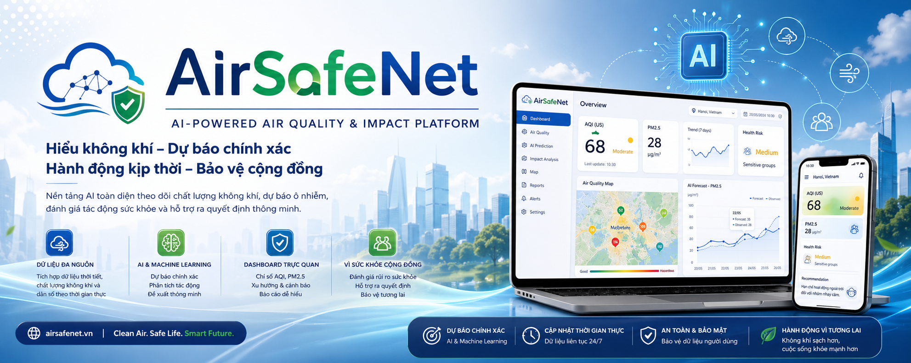

---

## Edition

<p align="center">
  <b>WEBSITE AND AI INNOVATION · AIR QUALITY MANAGEMENT · NET ZERO · GREEN TRANSITION · PUBLIC HEALTH</b>
</p>

**Objective:** Build an AI-powered platform that monitors, forecasts and explains air quality conditions, then converts AQI/PM2.5 data into practical actions for Ho Chi Minh City citizens, schools, families, commuters, outdoor activity groups and vulnerable users.

AirSafeNet does not stop at showing an AQI number. It answers real questions:

- When should I go outside today?
- Which hours should I avoid?
- Is it safe for my child to go to school at 7:00?
- Should a school hold outdoor PE or move it indoors?
- Should a respiratory patient wear an N95 mask?
- Which route from A to B gives lower PM2.5 exposure?
- Which transport option balances health risk and CO2 emissions?
- How fresh and trustworthy is the data behind this recommendation?

**Core innovation highlights:**

- **Ensemble AI forecasting** with Random Forest, ARIMA and XGBoost-style fallback logic.
- **Real-time anomaly detection** for sudden PM2.5 spikes with explainable factors.
- **Personalized safety recommendations** for children, elderly users, pregnant users, respiratory patients, motorbike commuters and outdoor athletes.
- **Daily Safety Briefing** that turns hourly forecast data into action guidance.
- **WHO-style Dose Budget** for estimating daily PM2.5 exposure.
- **Ward-level heatmap** for the new HCMC administrative boundary layer with 168 wards, communes and special administrative areas.
- **Clean Map and Cleanest Route Planner** that compare fastest, cleanest and balanced routes.
- **Net Zero mobility module** that compares CO2 emissions and PM2.5 exposure by transport mode.
- **School Green Safety Mode** for outdoor school activities and green behavior tracking.
- **Data Trust Card** for source, update time, AQI/PM2.5 value, confidence and realtime/forecast/fallback labeling.
- **Impact Dashboard** that measures warnings, rescheduled activities, reduced exposure minutes, dose saved, CO2 avoided and completed green actions.

---

## Screenshots

<table align="center">
<tr>
<td align="center" width="33%">
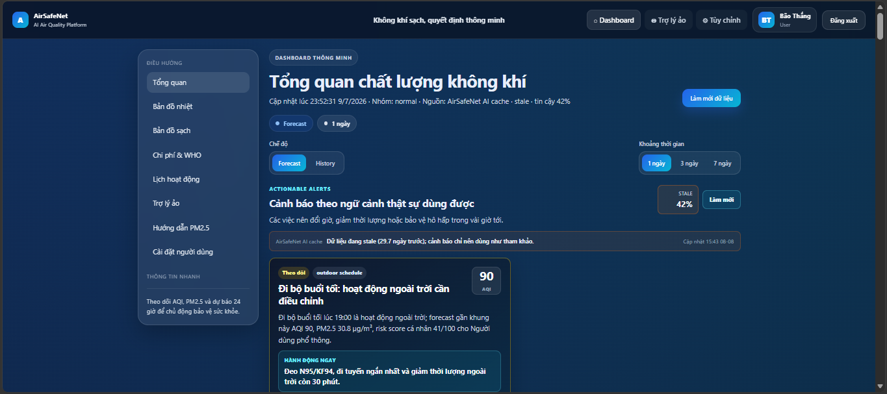
<b>AI Dashboard</b>
</td>
<td align="center" width="33%">
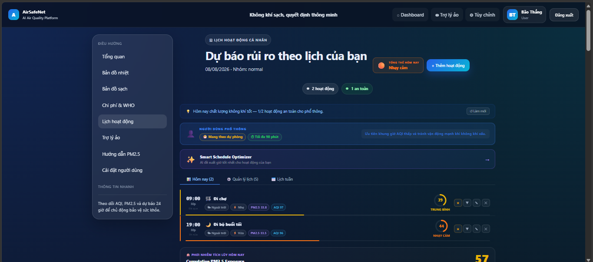
<b>Activity Planner</b>
</td>
<td align="center" width="33%">
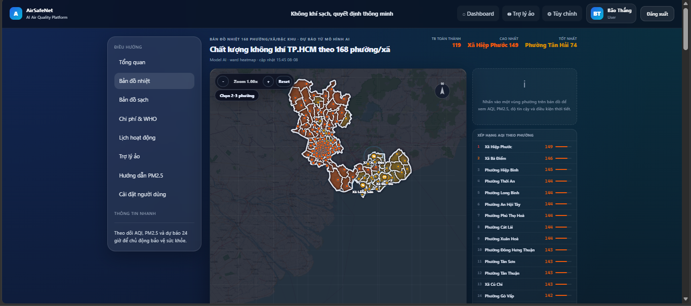
<b>Ward Heatmap</b>
</td>
</tr>
<tr>
<td align="center" width="33%">
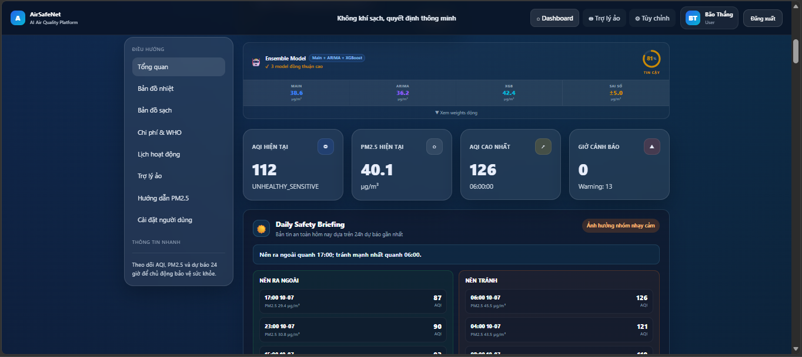
<b>Anomaly Detection</b>
</td>
<td align="center" width="33%">
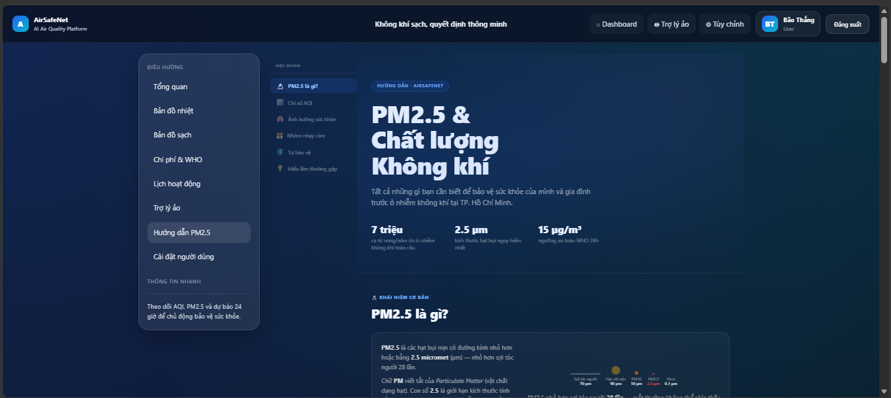
<b>PM2.5 Guide</b>
</td>
<td align="center" width="33%">
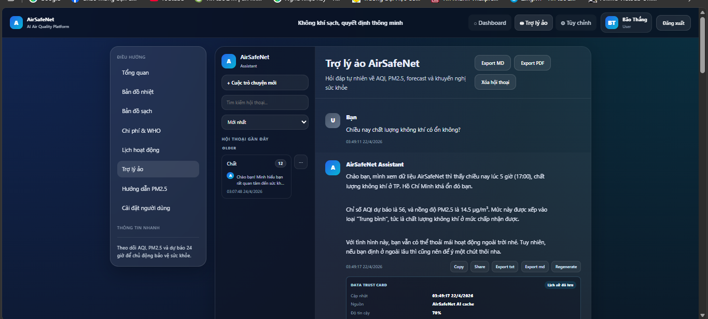
<b>AI Assistant</b>
</td>
</tr>
</table>

---

## Table of Contents

- [Why AirSafeNet](#why-airsafenet)
- [Competition Alignment](#competition-alignment)
- [User Groups](#user-groups)
- [Feature Overview](#feature-overview)
- [Ward Heatmap and Clean Map](#ward-heatmap-and-clean-map)
- [Data Sources and Trust](#data-sources-and-trust)
- [AI and Forecasting](#ai-and-forecasting)
- [System Diagrams](#system-diagrams)
- [Tech Stack](#tech-stack)
- [Getting Started](#getting-started)
- [Configuration](#configuration)
- [API Overview](#api-overview)
- [Project Structure](#project-structure)
- [Demo Scenarios](#demo-scenarios)
- [Model Artifact Policy](#model-artifact-policy)
- [Roadmap](#roadmap)

---

## Why AirSafeNet

Most air quality applications only show current readings. Users can see that air quality is bad, but they still do not know what to do next.

AirSafeNet moves the product from **reactive monitoring** to **proactive decision support**:

| Problem | AirSafeNet solution |
| --- | --- |
| Static AQI numbers | Hourly forecast, daily briefing and action recommendations |
| One-size-fits-all alerts | Health-profile rules for vulnerable and high-exposure groups |
| No activity guidance | What-if simulator, activity planner, commute planner and school event mode |
| Limited transparency | Data Trust Card, source health, confidence and explainability |
| No exposure quantification | Dose Budget and exposure reduction estimates |
| No map-level decision support | 168-area HCMC ward heatmap and clean route scoring |
| Green transition is disconnected from health | Net Zero mobility compares CO2 emissions with PM2.5 exposure |
| Impact is hard to prove | Impact Dashboard tracks alerts, reschedules, dose saved and CO2 avoided |

---

## Competition Alignment

| Competition focus | AirSafeNet implementation | Practical value |
| --- | --- | --- |
| Air quality management | Dashboard, forecast, heatmap, source health, Trust Panel | Shows air quality by time, area and risk level |
| AI application | Ensemble forecast, anomaly detection, explainability, AI Assistant | AI is used for prediction, reasoning and decision support |
| Public health | Health Profiles, Family Profiles, Dose Budget, contextual alerts | Protects children, elderly users, respiratory patients, pregnant users and commuters |
| Net Zero | Mobility CO2 comparison, clean route, green action tracking | Encourages lower-emission decisions without ignoring health risk |
| Green transition | School Green Safety Mode, commute planner, outdoor event recommendations | Turns environmental data into behavior change |
| Emission reduction | Transport mode comparison, carpool/bus suggestions, anti-idling reminder | Reduces avoidable transport emissions |
| Circular economy | Reusable bottle challenges, reduced single-use items, event waste sorting | Adds circular behavior without shifting away from air quality |
| Measurable impact | Impact Dashboard | Quantifies warnings, exposure reduction, dose saved and CO2 avoided |
| Data transparency | Data labels, source health, confidence, fallback status | Reduces the feeling that AI is guessing |
---

## User Groups

AirSafeNet is designed for realistic urban users:

- **General citizens** who need simple daily safety guidance.
- **Children and students** who need safer school commute and outdoor activity schedules.
- **Parents** who manage multiple family members under one account.
- **Elderly users** who are more sensitive to poor air quality.
- **Respiratory patients** such as asthma or chronic breathing condition groups.
- **Pregnant users** who need more cautious outdoor exposure guidance.
- **Motorbike commuters** who are directly exposed to traffic pollution.
- **Outdoor athletes** who need safer time slots for running, football or cycling.
- **Schools and youth organizations** that need decisions for PE classes, outdoor events and green activities.
- **Community managers and environmental teams** that need maps, alerts, source health and impact metrics.

---

## Feature Overview

### 1. AI Dashboard

The dashboard is the main decision surface of AirSafeNet.

It shows:

- Current AQI and PM2.5.
- Risk level and health recommendation.
- Hourly forecast charts and forecast table.
- Temperature, humidity, wind, UV, pressure and cloud condition.
- Compound risk score from PM2.5 plus weather factors.
- Anomaly banner when PM2.5 rises abnormally.
- Forecast accuracy score.
- Data source health.
- Daily Safety Briefing.
- What-if Activity Simulator.
- Commute Safety Planner.
- Net Zero Mobility Panel.
- Trust and Explainability Panel.
- School Green Safety Mode and outdoor event recommendation.
- Impact widgets.

### 2. Air Quality Management Panel

This module translates AQI/PM2.5 and weather forecast into clear actions:

- Best hours to go outside.
- Hours to avoid.
- Whether school outdoor activity should continue, move indoors or change time.
- Whether vulnerable users should wear a mask, reduce duration or reschedule.
- Estimated daily PM2.5 dose budget.
- Data labels such as realtime, forecast, estimated, stale and fallback cache.

### 3. Daily Safety Briefing

A morning-style briefing summarizes the day:

- Overall air quality condition.
- Safer outdoor windows.
- High-risk windows to avoid.
- Advice for children, respiratory users, elderly users, pregnant users and motorbike commuters.
- Mask recommendation.
- Estimated Dose Budget for the day.
- Practical actions such as reschedule, shorten activity duration or move indoors.

### 4. What-if Activity Simulator

Users can simulate a planned activity before doing it.

Inputs:

- Activity type: running, school commute, work commute, football.
- Duration.
- District or local area.
- Health profile.

Outputs:

- Risk if the activity starts now.
- Risk if moved to another hour.
- Three better time windows.
- Dose budget percentage consumed.
- Specific recommendation: delay, wear N95, reduce to 30 minutes, or stay indoors until a safer hour.

### 5. WHO-style Dose Budget

Dose Budget turns PM2.5 exposure into a daily budget concept:

- Estimates exposure by time, PM2.5 level and activity duration.
- Shows how much of the daily budget an activity consumes.
- Compares dose across different hours.
- Calculates dose saved after rescheduling.
- Adjusts sensitivity by health profile.

### 6. Health Profiles

AirSafeNet extends simple user groups into realistic health profiles:

- General user.
- Child/student.
- Elderly user.
- Asthma/respiratory condition.
- Outdoor athlete.
- Motorbike commuter.
- Pregnant user.

Each profile has its own rule set:

- AQI and PM2.5 alert thresholds.
- Mask recommendation rules.
- Maximum outdoor time guidance.
- Sensitivity multiplier.
- Context-specific actions.

### 7. Family Profiles

One account can track multiple family members:

- Children.
- Elderly relatives.
- Respiratory patients.
- Pregnant users.
- Motorbike commuters.
- Outdoor athletes.

Each profile can store:

- Name.
- Health group.
- Medical notes.
- Usual area.
- Outdoor schedule.
- Forecast-based risk.
- Personalized recommendation.

### 8. Contextual Alerts

Alerts are not limited to "AQI is high". AirSafeNet creates alerts based on real context:

- A child is about to go to school.
- A respiratory patient has an outdoor schedule.
- A user is preparing to run.
- A motorbike commuter is leaving during rush hour.
- PM2.5 spikes within the last 1-2 hours.
- Today's air quality is worse than the 7-day average.
- A planned activity overlaps with a high-risk forecast window.

Each alert includes:

- Reason.
- Source.
- Confidence.
- Recommended action.
- Read/unread state.
- Data status such as forecast, realtime spike or fallback cache.

### 9. Alert Inbox

The Alert Inbox keeps the warning history usable:

- Alert timeline.
- Read/unread status.
- Alert reason.
- Recommended action.
- Alert source: forecast, realtime spike, fallback cache or schedule conflict.
- Created time and read time.

### 10. Commute Safety Planner

The commute planner compares risk across departure windows.

Users provide:

- School or work departure time.
- Duration or time window.
- Health profile.

The app returns:

- Whether the planned departure time is safe.
- Better departure windows.
- Exposure reduction if delayed.
- Mask recommendation if departure cannot be changed.

### 11. Activity Planner and Weekly Planner

AirSafeNet supports planned outdoor behavior:

- Personal activity schedule.
- Forecast risk for each activity.
- Smart Schedule Optimizer.
- Golden Hour Picker.
- Weekly Planner View.
- Weekly Risk Matrix.
- Pattern Insight for recurring bad hours or bad days.
- Exposure Log for tracking recent PM2.5 exposure.

### 12. Forecast Accuracy Score

Forecast Accuracy Score compares previous predictions with later observed/current data:

- Forecast vs actual comparison.
- Error and accuracy indicators.
- Reliability score for the forecast model.
- Trust signal used by the dashboard and assistant.

### 13. Trust and Explainability Panel

For each forecast or warning, the panel can show:

- Last update time.
- Data source.
- Model confidence.
- AQI and PM2.5 used by the recommendation.
- Key influencing factors: PM2.5 history, wind, humidity, UV, temperature and pressure.
- Warning trigger type: forecast, realtime spike or fallback cache.
- Data quality label: realtime, forecast, estimated, stale or fallback.

### 14. School Green Safety Mode

A school-focused module for outdoor safety and green transition.

Schools can enter:

- PE class.
- Football session.
- youth organization activity.
- Outdoor ceremony or event.

AirSafeNet recommends:

- Continue outdoors.
- Move to a safer time.
- Move indoors.
- Prepare masks.
- Reduce activity duration.
- Remind parents not to idle motorbikes/cars at school gates.
- Track exposure minutes reduced.

### 15. School and Outdoor Event Mode

Event organizers can enter:

- Event name.
- Location.
- Start time.
- Duration.
- Participant size.
- Whether vulnerable groups are involved.

The app returns:

- Hold, delay, reschedule or move indoors.
- Mask preparation guidance.
- Safer replacement time.
- Estimated PM2.5 exposure reduction after changing schedule.

### 16. Net Zero Mobility Panel

The mobility module compares health risk and carbon impact for:

- Motorbike.
- Car.
- Bus.
- Walking.
- Bicycle.
- Carpooling.

It evaluates:

- PM2.5 exposure.
- CO2 emission.
- Travel time.
- Health profile suitability.
- Whether a low-carbon option is still safe under current AQI.

Example: cycling may reduce CO2, but if AQI is high at 7:00, AirSafeNet can recommend delaying to 8:30 or taking a bus with an N95 mask.

### 17. Circular Economy and Green Actions

Circular economy is attached to realistic green behavior rather than becoming a separate oversized module:

- Personal bottle challenge.
- Reduce single-use items in outdoor school events.
- Sort waste after school events.
- Prefer reusable materials for green activities.
- Record completed green actions.

### 18. Impact Dashboard

Impact Dashboard measures whether the project creates real change:

- Alerts sent.
- Activities moved to safer hours.
- PM2.5 exposure minutes reduced.
- Dose budget saved.
- CO2 avoided.
- Green actions completed.
- Beneficiary groups: children, respiratory users, elderly users and motorbike commuters.

### 19. AI Assistant

The AI Assistant is connected to AirSafeNet's practical modules.

Capabilities:

- Vietnamese natural-language questions such as: "Is it safe for my child to go to school at 7:00 tomorrow?"
- Answers grounded in forecast, School Mode, Family Profiles, Dose Budget and contextual alerts.
- Data Trust Card under each answer.
- Intent action buttons after answers:
  - Create alert.
  - View on map.
  - Find cleaner hours.
  - Compare route.
- Conversation history.
- Rename, pin, mark read and regenerate support.

Fallback chain:

1. Gemini response if `Gemini:ApiKey` is configured.
2. OpenAI fallback if Gemini fails and `OpenAI:ApiKey` is configured.
3. Local rule-based answer if both external AI providers fail.

### 20. Admin and Operations

Admin features include:

- Trigger AI forecast/cache compute.
- View AI cache status.
- Trigger district/ward heatmap compute.
- View district compute status.
- Clear cache when needed.
- Rate limiting for heavy compute endpoints.

### 21. Authentication and Preferences

The app includes:

- Register/login.
- JWT protected routes.
- Admin-only route guard.
- User preferences.
- Notification settings.
- Family profiles.
- Alert history.

### 22. PM2.5 Guide

The guide page helps non-technical users understand:

- What AQI means.
- What PM2.5 means.
- Which levels are good, moderate, unhealthy or very unhealthy.
- What vulnerable groups should do.
- When masks are recommended.
- How to reduce exposure in daily life.

---

## Feature Matrix

| Area | Main modules | Primary users |
| --- | --- | --- |
| Air quality management | Dashboard, forecast chart, current AQI, Trust Panel | Citizens, schools, community managers |
| Health personalization | Health Profiles, Family Profiles, Dose Budget | Families, vulnerable groups |
| Daily planning | Daily Safety Briefing, Activity Planner, Weekly Planner | Commuters, athletes, students |
| Event decisions | School Green Safety Mode, Outdoor Event Mode | Schools, organizers |
| Alerts | Contextual Alerts, Alert Inbox, Anomaly Spike Alert | All users |
| Maps | Ward Heatmap, Clean Map, Ward Comparison | Citizens, schools, outdoor groups |
| Routing | Fastest, cleanest and balanced route scoring | Commuters, parents, motorbike users |
| Net Zero | Mobility emission comparison, green actions | Green transition users, schools |
| Trust | Data Trust Card, source health, Forecast Accuracy Score | Judges, managers, users |
| AI Assistant | Gemini/OpenAI/local fallback, intent actions | Non-technical users |
| Impact | Exposure reduced, dose saved, CO2 avoided | Competition judges, project team, managers |
---

## Ward Heatmap and Clean Map

AirSafeNet separates two map experiences so the product can serve both quick visual monitoring and route-level decision support.

### Ward Heatmap

The heatmap keeps the original visual style while upgrading the geography layer.

Current implementation:

- New HCMC boundary layer with **168 wards, communes and special administrative areas**.
- Boundary source: `thanglequoc/vietnamese-provinces-database` GeoJSON.
- Frontend data file: `src/airsafenet_frontend/src/data/hcmcWardAirMap.ts`.
- AQI/PM2.5 at ward level is currently an AirSafeNet estimated layer based on AI cache, forecast and local area features.
- Clear ward boundaries.
- Clickable ward details.
- Pinned selection: selected ward information stays visible until the user selects another ward.
- Compare mode for selecting 2-3 wards.
- Zoom buttons.
- Mouse wheel zoom.
- Mouse drag/pan.
- GIS-style basemap layer for better orientation.

AQI color scale:

| Color | Meaning |
| --- | --- |
| Green | Good |
| Yellow | Moderate |
| Orange | Unhealthy for sensitive groups |
| Red | Unhealthy |
| Purple | Very unhealthy |

Ward click details:

- Current AQI.
- PM2.5.
- Last updated time.
- Data source.
- Confidence.
- Recommendation for children.
- Recommendation for asthma/respiratory users.
- Recommendation for motorbike commuters.
- Cleaner hours during the day.

### Three Map Zoom Levels

| Level | Purpose | Visible decisions |
| --- | --- | --- |
| City level | Overview of HCMC | High-pollution areas, top clean/worst areas |
| Ward level | Local neighborhood inspection | Boundary, average AQI, 24h forecast, sensitive places if data exists |
| Road level | Route-level exposure | Avoid segments, clean corridors, route comparison |

### Clean Map and Cleanest Route Planner

Users can enter:

- Origin A.
- Destination B.
- Departure time.
- Transport mode: motorbike, walking, bicycle, bus, car, carpool.
- Health profile: child, respiratory, elderly, pregnant, motorbike commuter, general.

AirSafeNet returns three route types:

- **Fastest route:** prioritizes travel time.
- **Cleanest route:** prioritizes lower PM2.5 exposure.
- **Balanced route:** avoids excessive detours while reducing exposure.

Cleanest Route Score combines:

- PM2.5 exposure.
- Travel time.
- Road type.
- Health profile.
- Data confidence.
- CO2 emissions by transport mode.

Example route comparison:

| Route | Time | Average AQI | Exposure | Recommendation |
| --- | ---: | ---: | --- | --- |
| A | 18 min | 142 | High | Fast, but not ideal for children or respiratory users |
| B | 23 min | 96 | 31 percent lower | Recommended for motorbike commuters and sensitive groups |
| C | 21 min | 115 | Medium | Balanced option |

Current note: the clean route experience is a prototype scoring module. Production-grade navigation should integrate a routing engine such as OSRM, GraphHopper or OpenRouteService plus real traffic and road-emission layers.

---

## Data Sources and Trust

AirSafeNet is designed around multi-source data and transparent fallbacks.

### Data Sources

| Source | Current role | Status |
| --- | --- | --- |
| Open-Meteo | Weather and hourly forecast features such as temperature, humidity, wind, UV, pressure and clouds | Active |
| OpenAQ | Open air-quality source for future or API-key-based integration | Ready to integrate |
| AI forecast cache | Stores forecast/current/history outputs produced by the AI server | Active |
| District/Ward cache | Stores heatmap data for map rendering | Active |
| Official monitoring stations | Placeholder for later integration with official environmental stations | Planned |
| Fallback cache | Keeps the app usable when external APIs fail | Active |

### Data Labels

| Label | Meaning |
| --- | --- |
| realtime | Recently updated current data |
| forecast | Predicted value from the AI/forecast pipeline |
| estimated | Estimated or spatially inferred value |
| stale | Older data, shown with caution |
| fallback-cache | Cached fallback because the live source failed |
| planned | Integration exists in design but source is not connected yet |

### Data Trust Card

Each assistant answer or major recommendation can show:

- Last updated time.
- Source name.
- AQI and PM2.5 values used.
- Whether the answer is based on realtime data or forecast data.
- Confidence score.
- Warning trigger: forecast, realtime spike or fallback cache.
- Main influencing factors.

---

## AI and Forecasting

The AI server powers forecasting, cache generation and anomaly detection.

### Forecast Engine

- Ensemble-style forecast using Random Forest, ARIMA and XGBoost-style fallback logic.
- Dynamic model weighting based on recent error when available.
- Hourly forecast for 24h/7-day views.
- Current snapshot by health profile.
- Forecast cache to avoid heavy per-request computation.
- Scheduler-based recomputation.
- Model metadata and feature column management.

### Anomaly Detection

- Detects sudden PM2.5 spikes.
- Uses recent history as context.
- Applies cooldown to avoid alert spam.
- Generates XAI-style explanation of likely contributing factors.
- Sends anomaly context back to backend alert logic.

### Forecast Accuracy

- Compares previous forecast with later observed/current values.
- Produces reliability score for users and judges.
- Helps the app communicate when the model should be trusted or treated carefully.

---

## System Diagrams

### Existing Architecture Diagram

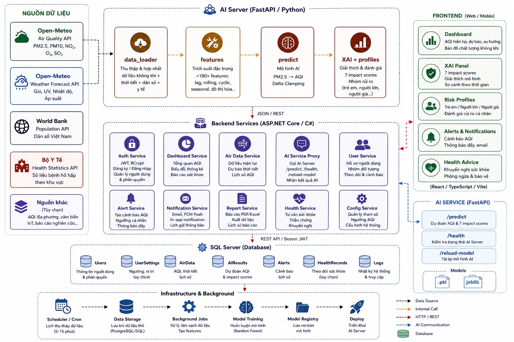

### CI/CD Diagram

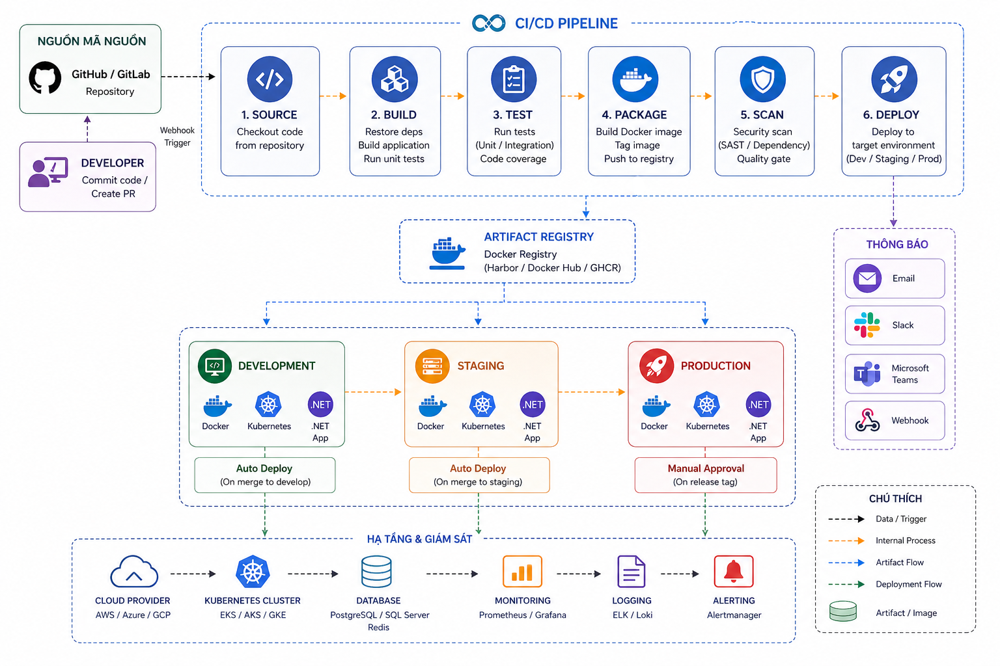

### Runtime Architecture

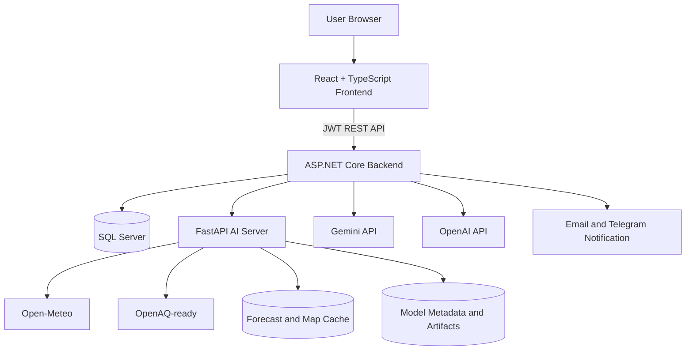
```mermaid
flowchart TB
    U[User Browser] --> FE[React + TypeScript Frontend]
    FE -->|JWT REST API| BE[ASP.NET Core Backend]
    BE --> DB[(SQL Server)]
    BE --> AI[FastAPI AI Server]
    BE --> GEM[Gemini API]
    BE --> OAI[OpenAI API]
    AI --> OM[Open-Meteo]
    AI --> OAQ[OpenAQ-ready]
    AI --> CACHE[(Forecast and Map Cache)]
    AI --> MODEL[(Model Metadata and Artifacts)]
    BE --> NOTI[Email and Telegram Notification]
```

### Data Pipeline

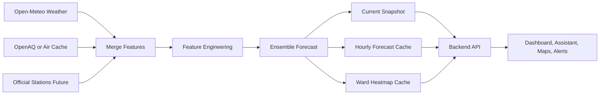
```mermaid
flowchart LR
    A[Open-Meteo Weather] --> M[Merge Features]
    B[OpenAQ or Air Cache] --> M
    C[Official Stations Future] --> M
    M --> F[Feature Engineering]
    F --> E[Ensemble Forecast]
    E --> C1[Current Snapshot]
    E --> C2[Hourly Forecast Cache]
    E --> C3[Ward Heatmap Cache]
    C1 --> BE[Backend API]
    C2 --> BE
    C3 --> BE
    BE --> UI[Dashboard, Assistant, Maps, Alerts]
```

### Recommendation Pipeline

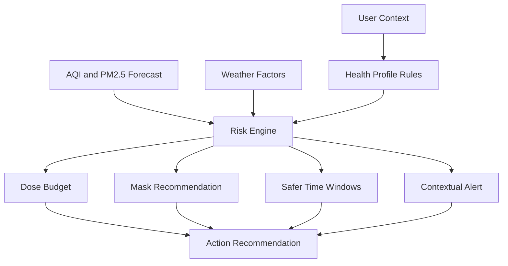
```mermaid
flowchart TD
    A[User Context] --> B[Health Profile Rules]
    C[AQI and PM2.5 Forecast] --> D[Risk Engine]
    E[Weather Factors] --> D
    B --> D
    D --> F[Dose Budget]
    D --> G[Mask Recommendation]
    D --> H[Safer Time Windows]
    D --> I[Contextual Alert]
    F --> J[Action Recommendation]
    G --> J
    H --> J
    I --> J
```

### Assistant Fallback Flow

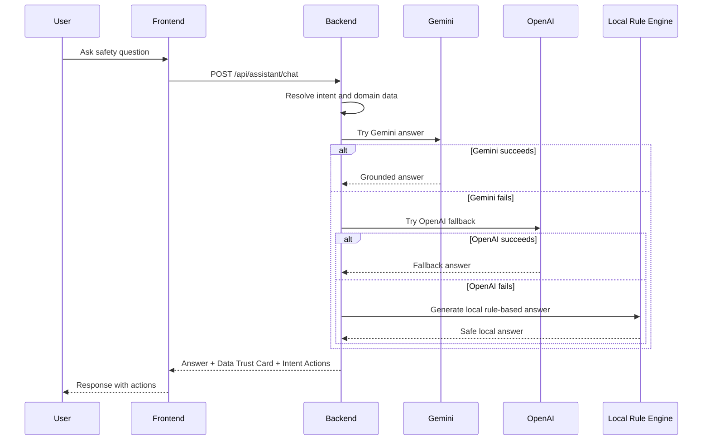
```mermaid
sequenceDiagram
    participant User
    participant Frontend
    participant Backend
    participant Gemini
    participant OpenAI
    participant Rules as Local Rule Engine

    User->>Frontend: Ask safety question
    Frontend->>Backend: POST /api/assistant/chat
    Backend->>Backend: Resolve intent and domain data
    Backend->>Gemini: Try Gemini answer
    alt Gemini succeeds
        Gemini-->>Backend: Grounded answer
    else Gemini fails
        Backend->>OpenAI: Try OpenAI fallback
        alt OpenAI succeeds
            OpenAI-->>Backend: Fallback answer
        else OpenAI fails
            Backend->>Rules: Generate local rule-based answer
            Rules-->>Backend: Safe local answer
        end
    end
    Backend-->>Frontend: Answer + Data Trust Card + Intent Actions
    Frontend-->>User: Response with actions
```

### Map and Route Scoring Flow

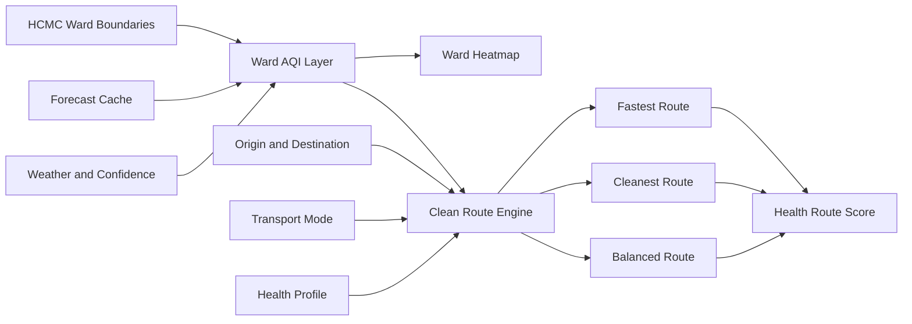
```mermaid
flowchart LR
    A[HCMC Ward Boundaries] --> B[Ward AQI Layer]
    C[Forecast Cache] --> B
    D[Weather and Confidence] --> B
    B --> HM[Ward Heatmap]
    B --> CR[Clean Route Engine]
    E[Origin and Destination] --> CR
    F[Transport Mode] --> CR
    G[Health Profile] --> CR
    CR --> R1[Fastest Route]
    CR --> R2[Cleanest Route]
    CR --> R3[Balanced Route]
    R1 --> S[Health Route Score]
    R2 --> S
    R3 --> S
```

### Alert Lifecycle

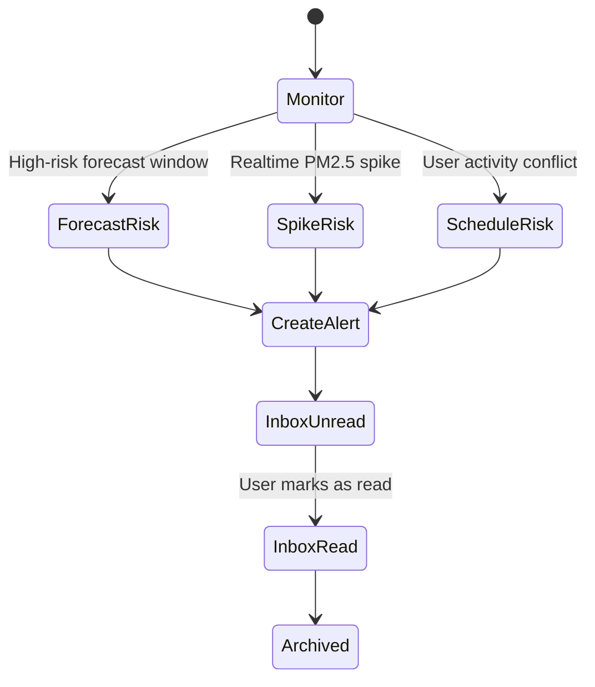
```mermaid
stateDiagram-v2
    [*] --> Monitor
    Monitor --> ForecastRisk: High-risk forecast window
    Monitor --> SpikeRisk: Realtime PM2.5 spike
    Monitor --> ScheduleRisk: User activity conflict
    ForecastRisk --> CreateAlert
    SpikeRisk --> CreateAlert
    ScheduleRisk --> CreateAlert
    CreateAlert --> InboxUnread
    InboxUnread --> InboxRead: User marks as read
    InboxRead --> Archived
```
---

## Tech Stack

### Frontend

- React 19.
- TypeScript 6.
- Vite 8.
- React Router.
- Recharts.
- React Markdown and remark-gfm.
- Custom CSS theme.
- SVG/GIS-style ward map layer.

### Backend

- ASP.NET Core 8.
- Entity Framework Core.
- SQL Server provider.
- JWT Bearer Authentication.
- Swagger/OpenAPI.
- HttpClient service layer.
- Rate limiting.
- BCrypt password hashing.
- Serilog-ready logging package.

### AI Server

- FastAPI.
- Uvicorn.
- Pandas and NumPy.
- scikit-learn.
- statsmodels.
- APScheduler.
- Joblib.
- Requests.

### Data and Infrastructure

- SQL Server for local/backend persistence.
- JSON/CSV AI cache files.
- Open-Meteo weather API.
- OpenAQ-ready configuration.
- Docker Compose files are included, but local manual setup is currently the safest path because the compose file may need path updates after project restructuring.

---

## Application Routes

| Route | Page |
| --- | --- |
| `/` | Landing/home page |
| `/login` | User login |
| `/register` | User registration |
| `/dashboard` | Main AI dashboard |
| `/heatmap` | Ward-level AQI/PM2.5 heatmap |
| `/clean-map` | Clean map and clean route planner |
| `/impact` | Impact dashboard |
| `/assistant` | AI Assistant |
| `/activity` | Activity planner |
| `/guide` | PM2.5/AQI education guide |
| `/preferences` | User settings, family profiles and alert history |
| `/admin` | Admin compute/cache tools |

---

## Getting Started

### Prerequisites

- .NET SDK 8.
- Node.js 20+ or 22+.
- Python 3.11+.
- SQL Server, SQL Server Express or LocalDB.
- Git.
- Docker Desktop if you want to experiment with containers.

### 1. Clone the repository

```powershell
git clone https://github.com/NguyenTriBaoThang/AirSafeNet.git
cd AirSafeNet
```

### 2. Start the AI server

```powershell
cd src/airsafenet_ai
python -m venv .venv
.\.venv\Scripts\Activate.ps1
pip install -r requirements.txt
uvicorn app.api:app --reload --host 0.0.0.0 --port 8000
```

Health check:

```powershell
Invoke-RestMethod http://localhost:8000/health
```

Trigger cache computation if needed:

```powershell
Invoke-RestMethod -Method Post "http://localhost:8000/admin/compute?force=true" -Headers @{ "X-Admin-Key" = "airsafenet-admin-secret" }
```

### 3. Start the backend

```powershell
cd src/airsafenet_backend/airsafenet_backend
dotnet restore
dotnet ef database update
dotnet run --launch-profile https
```

Default backend endpoints:

- HTTPS: `https://localhost:7276`
- HTTP: `http://localhost:5001`
- Swagger in Development: `https://localhost:7276/swagger`

The backend runs EF migrations on startup and seeds a default admin if none exists:

- Email: `admin@airsafenet.local`
- Password: `Admin@12345`

Change this account before any real deployment.

### 4. Start the frontend

```powershell
cd src/airsafenet_frontend
npm install
npm run dev
```

Frontend default URL:

```text
http://localhost:5173
```

If your backend URL differs, create `src/airsafenet_frontend/.env.local`:

```env
VITE_API_BASE_URL=https://localhost:7276
```

---

## Configuration

Use .NET user secrets for sensitive local values:

```powershell
cd src/airsafenet_backend/airsafenet_backend
dotnet user-secrets init
dotnet user-secrets set "Jwt:Key" "your-super-secret-key-min-32-chars"
dotnet user-secrets set "AiServer:BaseUrl" "http://localhost:8000"
dotnet user-secrets set "AiServer:AdminKey" "airsafenet-admin-secret"
dotnet user-secrets set "SeedAdmin:Key" "airsafenet-seed-2027"
dotnet user-secrets set "Gemini:ApiKey" "your-gemini-api-key"
dotnet user-secrets set "OpenAI:ApiKey" "your-openai-api-key"
dotnet user-secrets set "OpenAI:Model" "gpt-5-mini"
```

Main configuration keys:

| Key | Purpose |
| --- | --- |
| `ConnectionStrings:DefaultConnection` | SQL Server connection string |
| `Jwt:Key` | JWT signing secret |
| `Jwt:Issuer` | JWT issuer |
| `Jwt:Audience` | JWT audience |
| `AiServer:BaseUrl` | FastAPI AI server URL |
| `AiServer:AdminKey` | Admin key used when backend calls AI compute endpoints |
| `SeedAdmin:Key` | Key for protected admin seeding endpoint |
| `Gemini:ApiKey` | Gemini API key for primary assistant generation |
| `Gemini:Model` | Gemini model, default `gemini-2.5-flash` |
| `OpenAI:ApiKey` | OpenAI API key for assistant fallback |
| `OpenAI:Model` | OpenAI fallback model, default `gpt-5-mini` |
| `DataSources:OpenMeteo:Enabled` | Enables Open-Meteo source health reporting |
| `DataSources:OpenAQ:BaseUrl` | OpenAQ API base URL |
| `DataSources:OpenAQ:ApiKey` | Optional OpenAQ API key |
| `DataSources:OfficialStations:Enabled` | Enables future official station source |
| `DataSources:OfficialStations:BaseUrl` | Future official station endpoint |
| `Telegram:BotToken` | Telegram alert bot token |
| `Email:*` | SMTP settings for email alerts |
| `Notification:InternalKey` | Backend internal notification key |

---

## API Overview

### Backend API

| Group | Endpoints | Purpose |
| --- | --- | --- |
| Auth | `POST /api/auth/register`, `POST /api/auth/login`, `GET /api/auth/me`, `POST /api/auth/logout` | User authentication |
| Admin seed | `POST /api/auth/seed-admin` | Protected admin account seeding |
| Air | `GET /api/air/public/current`, `GET /api/air/current`, `GET /api/air/forecast`, `GET /api/air/history` | Current, forecast and history data |
| Air trust | `GET /api/air/sources`, `GET /api/air/explain` | Source health and explainability |
| Heatmap | `GET /api/air/districts`, `POST /api/air/districts/compute` | District/ward map cache bridge |
| Dashboard | `GET /api/dashboard/summary`, `GET /api/dashboard/chart`, `GET /api/dashboard/full` | Dashboard summary and chart data |
| Forecast accuracy | `GET /api/dashboard/forecast-accuracy` | Forecast vs actual scoring |
| Activity | `GET /api/activity`, `POST /api/activity`, `PUT /api/activity/{id}`, `DELETE /api/activity/{id}` | User activity schedules |
| Activity forecast | `GET /api/activity/forecast` | Risk forecast for activities |
| Alerts | `GET /api/alert/summary`, `GET /api/alert/contextual`, `GET /api/alert/history` | Alert summary, contextual warnings and inbox |
| Alert read state | `POST /api/alert/mark-read`, `POST /api/alert/{id}/read` | Mark alerts as read |
| Family profiles | `GET /api/familyprofiles`, `POST /api/familyprofiles`, `PUT /api/familyprofiles/{id}`, `DELETE /api/familyprofiles/{id}` | Family member management |
| Family risk | `GET /api/familyprofiles/{id}/risk` | Risk summary for a family profile |
| Assistant | `POST /api/assistant/chat`, `POST /api/assistant/regenerate` | AI assistant chat and regeneration |
| Assistant history | `/api/assistant/conversations` | Conversation list, detail, rename, pin, read state and delete |
| Anomaly | `GET /api/anomaly/latest`, `GET /api/anomaly/history`, `POST /api/anomaly/check` | PM2.5 spike detection |
| Admin | `POST /api/admin/compute`, `GET /api/admin/cache/status`, `DELETE /api/admin/cache/clear` | AI cache administration |
| District admin | `POST /api/admin/districts/compute`, `GET /api/admin/districts/status` | District/ward compute administration |
| Preferences | `GET /api/userpreferences`, `PUT /api/userpreferences` | User settings |
| Notification | `POST /api/notification/check-and-alert`, `POST /api/notification/test` | Alert dispatch |

### AI Server API

| Endpoint | Purpose |
| --- | --- |
| `GET /` | Basic service information |
| `GET /health` | Health, cache and compute status |
| `GET /model/info` | Model metadata |
| `GET /forecast/current` | Current snapshot by profile |
| `GET /forecast/range` | Forecast range by days/profile |
| `GET /history` | Historical data cache |
| `POST /admin/compute` | Recompute forecast/current/history cache |
| `GET /admin/cache/status` | Cache status details |
| `GET /admin/scheduler/status` | Scheduler status |
| `GET /districts/current` | Current district/ward map data |
| `POST /admin/districts/compute` | Recompute district/ward map cache |
| `GET /admin/districts/status` | District/ward compute status |
| `GET /anomaly/latest` | Latest anomaly |
| `GET /anomaly/history` | Anomaly history |
| `POST /anomaly/check` | Manual anomaly check |

Admin endpoints on the AI server require:

```http
X-Admin-Key: airsafenet-admin-secret
```
---

## Project Structure

```text
AirSafeNet/
  assets/
    diagrams/
      airsafenet_system_architecture.png
      airsafenet_cicd.png
    images/
      logo.png
      banner.png
    screenshots/
      dashboard.png
      activity.png
      heatmap.png
      anomaly.png
      guide.png
      assistant.png
  docs/
    AirSafeNet_ThuyetMinh_ChucNang_BTC.md
    AirSafeNet_ThuyetMinh_HoanChinh_BTC.md
    DOCKER.md
  docker/
    nginx.conf
  scripts/
    drift_check.py
    model_manifest.py
  src/
    airsafenet_ai/
      app/
        api.py
        aqi.py
        anomaly_detector.py
        cache_manager.py
        config.py
        data_loader.py
        districts.py
        ensemble_predict.py
        features.py
        predict.py
        profiles.py
        scheduler.py
      data/
        current_cache.json
        cache_meta.json
        anomaly_log.json
      models/
        model_metadata.json
        forecast_payload.json
        feature_cols.json
      requirements.txt
      Dockerfile
    airsafenet_backend/
      airsafenet_backend/
        Controllers/
        DTOs/
        Models/
        Services/
        Data/
        Migrations/
        Program.cs
        appsettings.json
        appsettings.Development.json
      airsafenet_backend.sln
      Dockerfile
    airsafenet_frontend/
      src/
        api/
        assets/
        components/
          assistant/
          common/
          dashboard/
          home/
          layout/
        data/
          hcmcWardAirMap.ts
          hcmcDistrictBoundaries.ts
          userProfileRules.ts
        hooks/
        pages/
          Dashboard.tsx
          HeatmapPage.tsx
          CleanMapPage.tsx
          ImpactPage.tsx
          AssistantPage.tsx
          ActivityPage.tsx
          GuidePage.tsx
          UserPreferences.tsx
          AdminPage.tsx
        styles/theme.css
        App.tsx
        main.tsx
      package.json
      vite.config.ts
  ARCHITECTURE.md
  MODEL_VERSIONING.md
  DEMO_SCRIPT.md
  README.md
  docker-compose.yml
```

---

## Demo Scenarios

### Scenario 1: Daily citizen decision

1. Login and open `/dashboard`.
2. Read Daily Safety Briefing.
3. Check recommended outdoor hours and hours to avoid.
4. Open Trust and Explainability Panel.
5. Confirm data source, update time, PM2.5 value and confidence.

### Scenario 2: Parent asks about school time

1. Open `/assistant`.
2. Ask: "Is it safe for my child to go to school at 7:00 tomorrow?"
3. Assistant uses forecast, Family Profiles, School Mode and Dose Budget.
4. Review the Data Trust Card.
5. Click "Find cleaner hours" or "Create alert".

### Scenario 3: Outdoor running what-if

1. Open Dashboard.
2. Use What-if Activity Simulator.
3. Select running, 45 minutes, local area and health profile.
4. Compare now vs later.
5. Choose one of the three safer time windows.

### Scenario 4: Ward map comparison

1. Open `/heatmap`.
2. Zoom into HCMC.
3. Click a ward to pin AQI/PM2.5 information.
4. Enable comparison mode.
5. Select 2-3 wards to compare outdoor activity suitability.

### Scenario 5: Clean route and Net Zero

1. Open `/clean-map`.
2. Enter origin, destination, departure time and transport mode.
3. Compare fastest, cleanest and balanced routes.
4. Review Health Route Score, PM2.5 exposure and CO2 emissions.
5. Choose a route that balances health and emissions.

### Scenario 6: School Green Safety

1. Open Dashboard or school module area.
2. Enter a PE class, football session or outdoor event.
3. Review recommendation: continue, reschedule, move indoors or prepare masks.
4. Track PM2.5 exposure minutes reduced.
5. Record green actions such as reusable bottles or waste sorting.

### Scenario 7: Impact presentation

1. Open `/impact`.
2. Show alerts sent.
3. Show activities moved to safer hours.
4. Show exposure minutes reduced.
5. Show dose budget saved.
6. Show CO2 avoided and green actions completed.

---

## Docker

Docker files are included for deployment experiments:

- `docker-compose.yml`
- `docker-compose.override.yml`
- `docker-compose.prod.yml`
- `src/airsafenet_ai/Dockerfile`
- `src/airsafenet_backend/Dockerfile`
- `src/airsafenet_frontend/Dockerfile`
- `docker/nginx.conf`

Because the project structure has changed during development, verify Docker paths before production use. In particular, backend build context may need to point to:

```text
./src/airsafenet_backend/airsafenet_backend
```

After checking `.env` values, run:

```powershell
docker compose up --build
```

For details, see [docs/DOCKER.md](./docs/DOCKER.md).

---

## Model Artifact Policy

Large model files should not be committed directly to GitHub.

Recommended approach:

- Commit code, metadata, feature column definitions and small demo cache files.
- Store real model artifacts in GitHub Releases, Git LFS, cloud object storage or a controlled drive folder.
- Document how to download or rebuild model artifacts.
- Keep `.gitignore` strict for large model outputs, temporary cache files and local datasets.
- Use `MODEL_VERSIONING.md` to track model identity, feature set and update history.

Current repository model-related files:

- `src/airsafenet_ai/models/model_metadata.json`
- `src/airsafenet_ai/models/feature_cols.json`
- `src/airsafenet_ai/models/forecast_payload.json`
- `scripts/model_manifest.py`
- `MODEL_VERSIONING.md`

---

## Data Limitations and Responsible Use

AirSafeNet is a research/prototype platform. It should be treated as decision support, not medical advice or an official environmental bulletin.

Important limitations:

- Ward-level AQI/PM2.5 values are currently estimated from available data and model logic.
- Official station integration is planned but not fully connected by default.
- Route-level exposure scoring is a prototype and should be upgraded with real routing, traffic and road-emission data before real navigation use.
- Fallback cache keeps the app usable, but stale data must be clearly labeled.
- Users with medical conditions should follow medical advice and official public health guidance.

AirSafeNet addresses these limitations through source labels, confidence, stale/fallback indicators and Data Trust Cards.

---

## Security and Privacy

- Do not commit API keys, JWT secrets, SMTP credentials or private datasets.
- Use `dotnet user-secrets` for local backend secrets.
- Use environment variables in deployment.
- JWT protects private routes.
- Admin-only route guard protects `/admin`.
- Passwords are hashed with BCrypt.
- Admin compute endpoints are rate-limited.
- Health and family profile data should be treated as sensitive data in real deployments.

See [SECURITY.md](./SECURITY.md) for the security policy.

---

## Roadmap

Planned improvements:

- Integrate official HCMC air-monitoring station data when available.
- Add production geocoding for address A-to-B input.
- Integrate OSRM, GraphHopper or OpenRouteService for real route geometry.
- Add traffic density, road type, construction and industrial hotspot layers.
- Improve ward-level interpolation with more monitoring points.
- Move heavy geospatial rendering to Leaflet, MapLibre or another GIS engine if needed.
- Add school, hospital, park and residential-sensitive-place datasets.
- Improve mobile map performance at high zoom levels.
- Add automated backend, frontend and AI pipeline tests.
- Standardize Docker Compose for production.
- Add model drift monitoring and retraining workflow.
- Expand Telegram, email and push notification channels.
- Add school/community admin dashboards.
- Generate periodic impact reports for schools or districts.

---

## Related Documentation

- [Competition write-up in Vietnamese](./docs/AirSafeNet_ThuyetMinh_HoanChinh_BTC.md)
- [Feature write-up in Vietnamese](./docs/AirSafeNet_ThuyetMinh_ChucNang_BTC.md)
- [Architecture](./ARCHITECTURE.md)
- [Model Versioning](./MODEL_VERSIONING.md)
- [Demo Script](./DEMO_SCRIPT.md)
- [Docker Guide](./docs/DOCKER.md)
- [Security Policy](./SECURITY.md)
- [Contributing](./CONTRIBUTING.md)
- [Support](./SUPPORT.md)

---

## One-line Summary

**AirSafeNet turns AQI/PM2.5 data into practical daily decisions: when to go outside, when to avoid exposure, which route to take, whether school activities should continue, how vulnerable groups should protect themselves and how low-emission choices can be balanced with health safety.**
